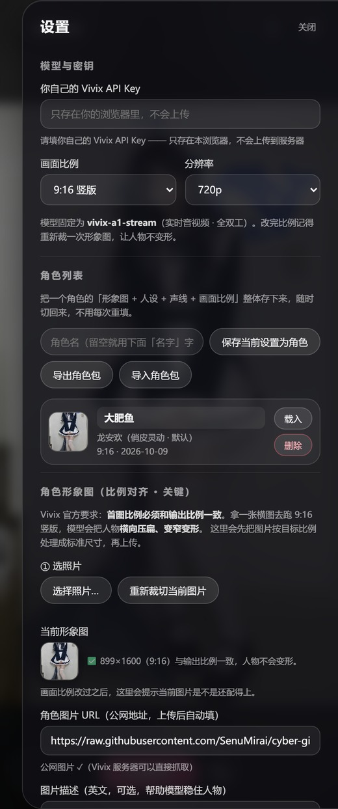

# 赛博女友

> 一个能**实时语音对话**的 AI 数字人网页应用。你说话，她看着你，用嘴型和动作回答，中途可以随时打断。
> 形象、人设、声音都能换成你自己的 —— 换一张照片、改一段文字就行。

**在线体验**：[cyber-girlfriend-019x.onrender.com](https://cyber-girlfriend-019x.onrender.com)
（需要自备一个 Vivix API Key，申请方法见下面，免费可拿）

 

---

## 这是什么

一个网页界面 + 一个本地小服务。界面负责显示和收声，真正的「让她说话、动起来」的能力由 **Vivix** 的实时数字人接口提供（模型 `vivix-a1-stream`）。

- **不用装 App** —— 手机浏览器打开就是完整功能，包括开麦说话。
- **自己的角色** —— 上传一张照片当形象，写一段文字当人设，挑一个声音，就是你的角色。
- **一套程序两种用法** —— 自己电脑上跑（本机版），或者部署到公网给所有人用（公网版）。代码是同一份。

> 说明：Vivix 的接口是按用量计费的（目前是 Developer Preview 阶段，可免费试用）。
> 本程序只是界面，不包含任何 Key —— **用谁的服务，就由谁提供自己的 Key**。

---

## 三步开始

1. 打开网址（或在本机双击 `启动.cmd`）。
2. 点右上角**齿轮**，把 Vivix API Key 粘进去，点最下面的**保存设置**。
3. 点中间的**开始聊天**。

想直接说话就点旁边的电话图标；手机上会问你要麦克风权限，允许就行。

程序里也内置了这份说明 —— 点右上角的 **?** 就能看到。

---

## 申请 Vivix API Key

1. 打开 **<https://platform.vivix.ai/>**，用邮箱注册一个账号。
2. 登录后点左侧菜单的 **API Keys**，新建一个。
3. 把生成的 Key 复制下来，粘到本程序设置面板的「Vivix API Key」里。

官方文档：<https://docs.vivix.ai/overview/introduction>

**关于 Key 的安全**：公网版里，Key **只保存在你自己那台设备的浏览器里**，不会上传到服务器。
所以换浏览器、换手机就要重填一次 —— 这是为了让别人的用量算在别人自己账上。

---

## 换成你想要的角色

设置面板里能改这几样，改完点「保存设置」：

| 项目 | 说明 |
|---|---|
| **角色形象图** | 换一张照片。程序会先按画面比例自动裁好再上传，不用自己算尺寸。 |
| **人设** | 用大白话描述她是谁、什么性格、怎么说话。写得越具体，她越像。 |
| **声音** | 内置 40 多种音色（男声、少年音、各地口音），选好可以点「试听」。 |
| **开场白** | 她主动说的第一句话。 |
| **运动控制** | 高级项。已内置「镜头跟随、稳定上半身、少转头、可走动」的约束，一般不用动。 |

调顺了之后点 **保存当前设置为角色**，以后一键切回来。
**导出角色包**可以把整套存成文件，换设备时再 **导入**。

> 关于形象图：Vivix 要求**首图比例必须和输出比例一致**。拿横图去跑 9:16 竖版，人物会被横向压扁。
> 本程序会自动按目标比例处理，所以正常不会变形；如果你手动填外部图片 URL，请自己保证比例一致。

---

## 两种用法

### 用法一：本机自用（默认）

双击 `启动.cmd`，浏览器会自动打开 `http://localhost:3000`。

- Key 保存在本机的 `config.json` 里。
- 点右上角**手机图标**出二维码，手机连**同一个 Wi-Fi** 扫码就能打开，还能开麦。
- 只有你局域网里的人能用。

### 用法二：部署到公网（给所有人用）

想看所有人能访问的部署方式，见 **[DEPLOY.md](DEPLOY.md)** —— 里面有 Render / Fly.io / Railway 三条路的逐步说明，免费档就够用。

公网版和本机版的区别：

| | 本机版 | 公网版 |
|---|---|---|
| 谁能用 | 只有你（或局域网） | 拿到网址的所有人 |
| API Key | 存在本机 `config.json` | **每位使用者自带**，只存在他自己浏览器里 |
| 角色数据 | 存本机，永久 | 每人一份互相看不见；免费档重启会清（见下） |
| 形象图 | 传到 GitHub 或本地 | 传到这个服务自己身上，自动生成公网直链 |

---

## 常见问题

**第一次打开很慢，转圈很久**
免费服务器闲置时会休眠，唤醒要 30～60 秒。等一下就好，不是坏了。

**提示 `invalid api key`**
Key 抄错了（注意别带多余空格），或者 Vivix 那边额度用完了。

**换浏览器 / 换手机要重填 Key**
正常。公网版的 Key 只存在本地浏览器里，为的是不让别人用掉你的额度。

**存的角色不见了**
免费档的服务器不能挂持久磁盘，重启会清空数据。
重要角色记得用**导出角色包**存一份，重启后再导入。

**上传的图人物变窄、拉长了**
形象图比例和输出比例要一致。本程序会自动裁；如果你改过画面比例，记得点「重新裁切当前图片」。

**手机上扫不开二维码（本机版）**
确认手机和电脑连的是同一个 Wi-Fi。路由器如果开了「AP 隔离」，手机会连不上电脑，去路由器设置里关掉。

**这是账号系统吗？能登录回旧数据吗？**
不是。公网版只是给每个浏览器发一个身份标识来分开存数据，没有密码，
换浏览器就是一份新数据。够用，但别拿它存敏感东西。

---

## 给想改代码的人

```
server.mjs          HTTP 服务 + Vivix 接口代理 + 图片上传（约 1300 行）
src/main.js         前端源码（esbuild 打包成 public/app.js）
public/             前端产物（index.html / style.css / app.js）
defaults/           内置默认角色「大肥鱼」
tools/              打包脚本（单文件 EXE / 安装包）
installer/          安装包模板
Dockerfile          公网部署镜像
DEPLOY.md           公网部署教程
```

```bash
npm install
npm run dev          # 打包前端 + 启动服务，改 src/main.js 后重跑
npm run build:exe    # 打包成免装 Node 的单文件 dist/赛博女友.exe
npm run build:all    # 上面那个 + 安装包
```

服务端认环境变量：`CG_PUBLIC=1` 开公网模式，`CG_DATA_DIR` 指定数据目录，`PORT` 指定端口。
完整清单见 [.env.example](.env.example)。

---

## 说明

本程序只提供界面与角色管理，音视频能力来自 [Vivix](https://vivix.ai)，
使用时请遵守 Vivix 的服务条款。请勿用于生成违法违规内容。
